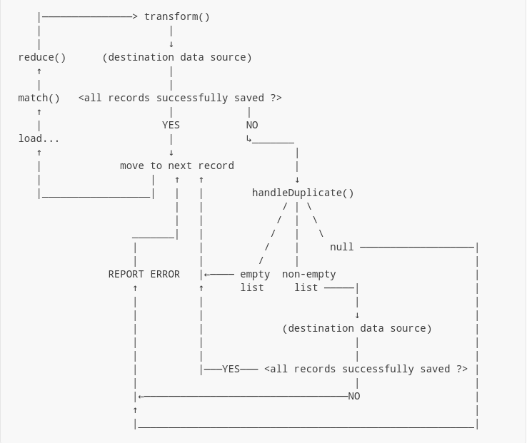

# Handling Duplicates

- [Handling Duplicates](#handling-duplicates)
  - [Overview](#overview)
  - [Strategy 1: Don't care](#strategy-1-dont-care)
  - [Strategy 2: Ignore](#strategy-2-ignore)
  - [Strategy 3: Actually care](#strategy-3-actually-care)
  - [To Sum It Up](#to-sum-it-up)
  - [See also](#see-also)

## Overview

In the previous article, we discussed
[the full migration process](./002-matching-and-averaging.md#the-full-migration-process).
We could see that the method

```java
public List<AreaEntity> handleDuplicate(
    // import com.example.mjg.exceptions.DuplicateDataException;
    DuplicateDataException e,
    SrcEntity inputRecord,
    List<DestEntity> outputRecords,
    SrcStore srcStore,
    DestStore destStore,
    // import com.example.mjg.storage.DataStoreRegistry;
    DataStoreRegistry dataStoreRegistry
) {
    // ...
}
```

accepts `e`, an instance of type `DuplicateDataException`.

Call `e.getCause()` to get the actual original
exception. We handle that exception depending
on the kind of **output** datastore we are dealing
with (this does not depend on the input store or
any other store).

- **For JPA (SQL)**, that original exception is of type
    `DataIntegrityViolationException` or any of its
    subclasses.

    ```java
    import org.springframework.dao.DataIntegrityViolationException;
    ```

- **For MongoDB**, it is also of type `DataIntegrityViolationException`,
    or `DuplicateKeyException`, or any of their
    subclasses. Note that it is

    ```java
    // true - for MongoDB
    import com.mongodb.DuplicateKeyException;
    ```

    not

    ```java
    // false - MongoDB won't throw this
    import org.springframework.dao.DuplicateKeyException;
    ```

    A lot of people confuses this! `spring-data-mongodb` is just that special.

- Other types of datastores in the future, or your own
    custom stores, have their own conventions. If you
    only use JPA and/or MongoDB, this doesn't matter.

## Strategy 1: Don't care

Simply return `null` in the method body.

That's what we've been doing so far - do not
handle duplicate errors. Then, `mjg` would
immediately report the current input record
as "fail to migrate", and will log the error
in the *migration progress data*.

## Strategy 2: Ignore

To recap: if the output records returned by
`transform()` fail to migrate due to a data
duplicate error, `handleDuplicate()` will be
called.

If `handleDuplicate()` doesn't return `null`,
it is expected to return the alternative output
records.

So if we just want to ignore duplicate records -
that is, we don't want `mjg` to log the error,
just skip it silently - simply return an empty
list of alternative output records.

```java
public List<AreaEntity> handleDuplicate(
    DuplicateDataException e,
    AreaEntity inputRecord,
    List<AreaEntity> outputRecords,
    SrcAreaStore srcAreaStore,
    DestAreaStore destAreaStore,
    DataStoreRegistry dataStoreRegistry
) {
    return List.of();
}
```

## Strategy 3: Actually care

In this case, you want to inspect the
underlying cause of the problem, then
return the fixed record(s). Something
like:

```java
public List<AreaEntity> handleDuplicate(
    DuplicateDataException e,
    AreaEntity inputRecord,
    List<AreaEntity> outputRecords,
    SrcAreaStore srcAreaStore,
    DestAreaStore destAreaStore,
    DataStoreRegistry dataStoreRegistry
) {
    // The output store is MongoDB so use:
    // import com.mongodb.DuplicateKeyException;
    DuplicateKeyException cause = e.getCause();
    if (isAreaCodeDuplicated(cause)) {
        // assign another code
        String newCode = generateNewAreaCode();
        AreaEntity newOutputRecord = new AreaEntity();
        newOutputRecord.setAreaCode(newCode);
        // assign other fields to newOutputRecord, then
        return List.of(newOutputRecord);
    }

    // Can't handle if not the area code
    // being duplicated, but something else
    return null;
}

public static boolean isAreaCodeDuplicated(
    DuplicateKeyException e
) {
    // I don't know, write it yourself
}

public static String generateNewAreaCode() {
    // ...
}
```

Note that if the new output records also
fail to migrate, there is no second chance:
the input record will straight up be reported
as failed to migrate - even if the new error
is still a duplicate data exception.

## To Sum It Up

Following is the flow of `mjg`'s data
duplication error handling, in full.



## See also

- [Home](./README.md)
- [Previous: Advanced Example - Matching and Averaging](./002-matching-and-averaging.md)
- [Next: Advanced Example - Multiple Matchings](./004-multiple-matchings.md)
