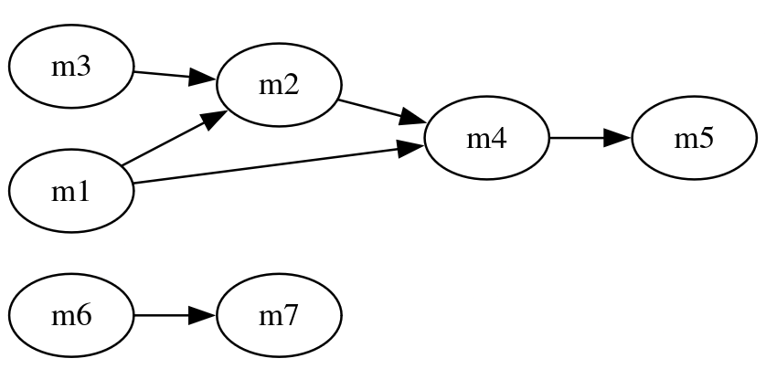
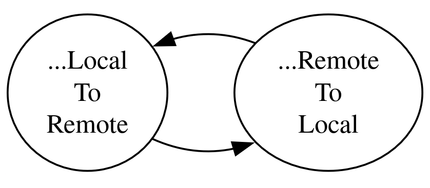

# Chaining Migrations

- [Chaining Migrations](#chaining-migrations)
  - [Automatic Chaining](#automatic-chaining)
    - [Datastore Dependencies of a Migration](#datastore-dependencies-of-a-migration)
    - [From Datastore Dependencies to Migrational Dependencies](#from-datastore-dependencies-to-migrational-dependencies)
    - [From Migrational Dependencies to Task Graph](#from-migrational-dependencies-to-task-graph)
    - [Reliability of the Algorithm](#reliability-of-the-algorithm)
    - [Cycles in the Task Graph and the Need for Customization](#cycles-in-the-task-graph-and-the-need-for-customization)
  - [Manual Reordering](#manual-reordering)
  - [See also](#see-also)

## Automatic Chaining

In a previous article
[we have created a new migration class](./005-create-pivot-tables.md#it-is-a-new-migration-class).
What happens if there are two or more
migration classes in our program? Which one would
be run first by `mjg`?

In fact, `mjg` has a mechanism to automatically
deduce the order of migrations, based on
_datastore dependencies_.

### Datastore Dependencies of a Migration

Let's revisit the two migrations we've created
so far.

1. `MigrateAreasFromSrcToDest` -
   [from this article](./004-multiple-matchings.md#our-migration-class).

   ```java
   @Migration
   @ForEachRecordFrom(
       value = SrcAreaStore.class
   )
   @MatchWith(
       value = TempStore.class
   )
   @MatchWith(
       value = HouseStore.class
   )
   @TransformAndSaveTo(
       value = DestAreaStore.class
   )
   public class MigrateAreasFromSrcToDest { /*...*/ }
   ```

2. `PopulatePivotTableHousesPersons` -
   [from this article](./005-create-pivot-tables.md).

   ```java
   @Migration
   @ForEachRecordFrom(
       value = PersonStore.class,
       batchSize = 128
   )
   @MatchWith(
       value = HouseStore.class
   )
   @TransformAndSaveTo(
       value = HousePersonStore.class
   )
   public class PopulatePivotTableHousesPersons { /*...*/ }
   ```

**Definition 1.** The _datastore dependencies_, or the
_input_ of a _migration_, are its _source datastore_
along with all of its _matching datastores,_ if any.

We can see that a migration has _at least_
_one datastore dependency_ - in which case it
has no matching stores (no `@MatchWith`) while
the source store (`@ForEachRecordFrom`) is
mandatorily always present.

**Definition 2.** The _output store_, or simply
the _output_ of a _migration_, is specified
in the `@TransformAndSaveTo` annotation.

So there is only one output store for each
migration.

For the two migrations we've seen:

| Migration | `MigrateAreasFromSrcToDest` | `PopulatePivotTableHousesPersons` |
| --------- | --------------------------- | --------------------------------- |
| Input     | 1. `SrcAreaStore`           | 1. `PersonStore`                  |
|           | 2. `TempStore`              | 2. `HouseStore`                   |
|           | 3. `HouseStore`             |                                   |
| Output    | `DestAreaStore`             | `HousePersonStore`                |

### From Datastore Dependencies to Migrational Dependencies

In the previous section we've seen
*datastore dependencies* - a kind of
dependency that exists between a migration
and its input (source + matching) datastores.

In this section, we will examine *datastore*
*dependencies* of every migration to decide
an order of execution for the migrations.

Here, datastores are denoted
by capital letters `A, B, C, D`... Migrations
are denoted by `m1`, `m2`, `m3`, etc.

Imagine `m1` has input `A, B` and output `C`.
We write:

    m1: (A, B) -> C

Similarly, suppose:

    m2: (C, E) -> F
    m3: (A, D) -> E

What is the correct order of running those
three migrations, then?

Since `m3`'s output is `E`, and `E` is
an input of `m2`, we definitely need to
run `m3` before `m2`.

    m3 before m2

Similarly we have

    m1 before m2

due to `C` being output of `m1` and an
input of `m2`.

At this point we can see the rule:

**Rule 1.** A migration `mi`
must be run before `mj` if and only if
the output of `mi` is in
the input of `mj`.

Let `INPUT(mx)` be the set of input stores
of migration `mx`, and `output(mx)` be the
output store of `mx`, we can formulate
**Rule 1** as follows:

    mi before mj <=> output(mi) ∈ INPUT(mx)

While `INPUT(mx)` is the *datastore dependencies*
of one migration `mx`, **Rule 1** regulates
the **migrational dependencies** - a kind of
dependency that exists among migrations,
e.g. `mi before mj` (`mi` must be run before
`mj`) means `mj` **depends** on `mi`.

Bravo! We've just translated *datastore dependencies*
of individual migrations to *migrational dependencies*
among them!

Back to our example, since we have

    output(m3) = E
    INPUT(m2) = { C, E }
    => output(m3) ∈ INPUT(m2)

    <=> m3 before m2

and similarly

    ...
    <=> m1 before m2

So we end up with these two possibly correct *orders*
*of execution* for our three migrations:

    m1, m3, m2

or

    m3, m1, m2

Turns out, both of them are correct,
since there exists no migrational dependencies 
between `m3` and `m1`. Indeed, we have

    INPUT(m3) = { A, D }
    output(m3) = E

    INPUT(m1) = { A, B }
    output(m1) = C

    =>      output(m3) ∉ INPUT(m1)
    and     output(m1) ∉ INPUT(m3)

hence `m1` and `m3` could be run in any
order, but *all of them* must complete
before `m2` starts.

### From Migrational Dependencies to Task Graph

By applying **Rule 1** to all *migration classes*
defined in the program, `mjg` is able to build
*migrational dependencies* between them. Suppose
it has established the following migrational
dependencies:

    m3 before m2
    m1 before m2
    m1 before m4
    m2 before m4
    m4 before m5
    m6 before m7

The migrational dependency graph, aka the task graph,
would be:



From this task graph, `mjg` will be able to build
a correct order of execution for all the migrations
defined in your program. This is called **Automatic Chaining**,
one of the best selling points of `mjg` !

Note that **one task graph might result in**
**multiple correct execution orderings**. For example,
from the above task graph, here are some
correct solutions:

    m6, m7, m1, m3, m2, m4, m5
    m6, m7, m3, m1, m2, m4, m5
    m1, m3, m2, m4, m5, m6, m7
    ...

The order of execution for migration classes
in your program will be determined at *compile time*
by `mjg`. When you run a compile command e.g.

```sh
mvn clean compile test-compile
```

you'll see `mjg` prints out the execution order
that it has resolved, e.g.

    ...
    MIGRATIONS' ORDER OF EXECUTION:
        1. org.example.your_app.migrations.M6
        2. org.example.your_app.migrations.M7
        3. org.example.your_app.migrations.M1
        4. org.example.your_app.migrations.M3
        5. org.example.your_app.migrations.M2
        6. org.example.your_app.migrations.M4
        7. org.example.your_app.migrations.M5
    ...

The execution order will be respected at runtime
by `mjg` when you
[run your migrations with `migrationService.run()`](./001-simple-example.md#5-run-mjg).

### Reliability of the Algorithm

`mjg` uses a variant of topological sort ("toposort")
to sort the migrations to the correct order
of execution, based on *migrational dependencies*
as we discussed above.

This has been tested thoroughly in our test cases.

### Cycles in the Task Graph and the Need for Customization

For example, you have the following migrations
along with their input/output:

    MigrateAreasFromSrcToDest:
        (SrcAreaStore, TempStore, HouseStore) -> DestAreaStore
    
    MigrateDestAreaToBackupDestArea:
        (DestAreaStore) -> DestAreaBackupStore

`mjg` would straight up decide that this is the
correct order of execution for these two migrations:

    MigrateAreasFromSrcToDest, MigrateDestAreaToBackupDestArea

because it is applying **Rule 1**. Here, `DestAreaStore`
is output of the first and in the input of the second
migration.

However, you might be a very careful person who would
want to move the existing data in `DestAreaStore` to
a backup location, `DestAreaBackupStore`, before migrating
new data from `SrcAreaStore`. Then, you actually want
the *reverse* order:

    MigrateDestAreaToBackupDestArea, MigrateAreasFromSrcToDest

As you can see, the **Automatic Chaining** feature of
`mjg` would be of great use when the number of datastores to
migrate is very large (e.g. > 20) and you don't want to
work out the order of execution yourself with pen and paper.
That would save you a great amount of time. But sometimes,
like in this example, `mjg`'s assumption is not as you
expect. So you need a way to *customize the ordering as necessary*.

Another circumstance when you would absolutely want to
*customize*, is that there exists a *cycle* in the migrational
dependency graph/task graph. For example, to do a two-way
synchronization between two datastores (just like OneDrive/MEGA
syncing files from your local machine to the cloud and back):

    MigrateStatisticsFromLocalToRemote:
        (LocalStatStore) -> RemoteStatStore
    MigrateStatisticsFromRemoteToLocal:
        (RemoteStatStore) -> LocalStatStore

Here we see a *cycle* in the task graph.



When there is a *cycle* like this, `mjg` would not be sure
which one should run first! And upon compilation, it will
give you some error like:

    Cycle detected while resolving migrations' dependency.
    Check that there are no loops, no mutual dependencies
    (e.g. A -> B and B -> A), and most importantly, there
    must be no two migration with the same source and/or
    target data stores (which are defined in @ForEachRecordFrom
    and @TransformAndSaveTo)

    Original exception:
    ...

That's when you do not only *need*, but you also *have to*
tell `mjg` the desired order of execution for your
migrations.

## Manual Reordering

Remember [you could reorder the matchings](./004-multiple-matchings.md#the-order-of-matchings)?
You can also do the same with migrations in
a very similar way!

The default order for all migrations is also `0`.
To run a migration earlier? Set its order to `-1`
or less. Later? Set the order to `1` or more.
Simple as that.

For example:

```java
@Migration(order = -1)
@ForEachRecordFrom(
    value = DestAreaStore.class
)
@TransformAndSaveTo(
    value = DestAreaBackupStore.class
)
class MigrateDestAreaToBackupDestArea { /*...*/ }
```

Of course, if you want to, you could
manually set the order for ALL your
migrations. But there is no reason
to do that laborous work.

1. **Automatic Chaining** has you covered
    with its sensible migration sorting.
2. You only need to set the order of some
    special migrations, as discussed in
    [the previous section](#cycle-in-the-task-graph-and-the-need-for-customization).
3. You don't trust `mjg`? Just read the
    order of migrations sorted and
    printed to console by `mjg` during
    compilation, and see whether it
    matches your expectation!
4. The order of migrations might vary
    from one compilation to another, simply
    because one task graph might result
    in several orderings that satisfy
    the dependency requirement, as previously
    [discussed in this section](#from-migrational-dependencies-to-task-graph).

## See also

- [Home](./README.md)
- [Previous: Advanced Example - Create Pivot Tables](./005-create-pivot-tables.md)
- [Next: Fault Tolerance](./007-fault-tolerance.md)
